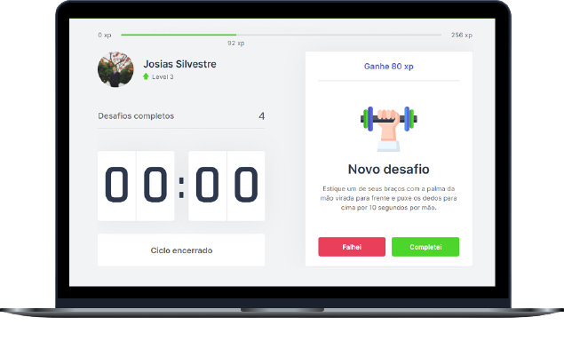

<h1 align="center">
  
</h1>

  <a href="#-tecnologias">Technologies</a>&nbsp;&nbsp;&nbsp;|&nbsp;&nbsp;&nbsp;
  <a href="#-projeto">Project</a>&nbsp;&nbsp;&nbsp;|&nbsp;&nbsp;&nbsp;
  <a href="#-layout">Layout</a>&nbsp;&nbsp;&nbsp;|&nbsp;&nbsp;&nbsp;
  <a href="#-como-executar">How to run</a>&nbsp;&nbsp;&nbsp;|&nbsp;&nbsp;&nbsp;
  <a href="#-licença">License</a>

  

 

 

  

## ✨ Technologies

This project was developed with the following technologies:

- [React](https://reactjs.org)
- [Next.js](https://nextjs.org/)
- [TypeScript](https://www.typescriptlang.org/)

## 💻 Project

Move.it is an app that combines Pomodoro's technique with physical exercises for those who spend a lot of time in front of the computer.

## 🔖 Layout

You can view the layout of the project through [this link] (https://www.figma.com/file/ge20pu3ofMOKoliUyKx1Nl/Move.it-1.0). You must have an account at [Figma] (http://figma.com/) to access it.

## 🚀 How to run

- Clone the repository
- Install dependencies with `yarn`
- Start the server with `yarn dev`

You can now access [`localhost: 3000`] (http://localhost:3000) from your browser.

## 📄 License

This project is under the MIT license. See the [LICENSE] file (LICENSE.md) for more details.

---

Project developed in the fourth Next level Week produced by Rocketseat ♥
